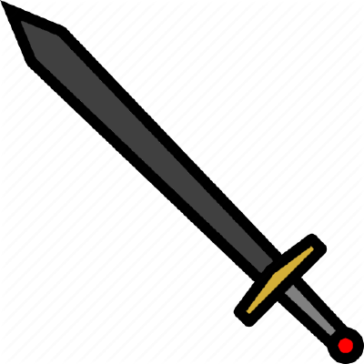

<AUTOGENERATED_TABLE_OF_CONTENTS>

### Content 1

My new content here...
[This links to another document](otherDoc.md)

### Content 2



<!--DOCUSAURUS_CODE_TABS-->
<!--JavaScript-->

```js
console.log('Hello, world!');
```
<!--Python-->

```py
print('Hello, world!')
```

<!--C-->

```C
#include <stdio.h>

int main() {
   printf("Hello World!");
   return 0;
}
```

<!--Pascal-->

```Pascal
program HelloWorld;
begin
  WriteLn('Hello, world!');
end.
```

<!--JSX-->

```jsx
class Example extends React.Component {
  render() {
    return (
      <View style={{flex: 1, alignItems: 'center', justifyContent: 'center'}}>
        <Text>Docusaurus</Text>
        <Button
          title="Click me"
          onPress={() => this.props.navigation.push('Docusaurus')}
        />
      </View>
    );
  }
}
```

<!--END_DOCUSAURUS_CODE_TABS-->